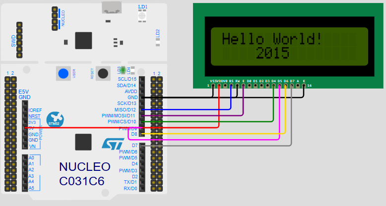

# Wokwi Simulation - Nucleo_F411RE with LCD1602 I2C Module

This project simulates the use of the **Nucleo_F411RE** board with an **LCD1602 I2C Module** on the Wokwi platform. The goal is to demonstrate how to interface an I2C-based LCD module with STM32 microcontroller, leveraging the Wokwi simulation environment.

## Project URL

You can access and simulate the project on Wokwi using the following URL:

[https://wokwi.com/projects/427510893339421697](https://wokwi.com/projects/427510893339421697)

## Hardware Used

- **Board**: STM32 Nucleo F411RE
- **LCD Module**: LCD1602 I2C

### Pin Connections:

Here are the pin connections for the LCD1602 I2C module to the Nucleo board:

| **LCD1602 Pin** | **Nucleo Pin**     | **Color**   | **Notes**       |
|-----------------|--------------------|-------------|-----------------|
| `VSS`           | `GND.9`            | Black      | Ground          |
| `K`             | `GND.9`            | Black      | Ground          |
| `RW`            | `GND.9`            | Black      | Ground          |
| `VDD`           | `5V.2`             | Red        | 5V Power        |
| `RS`            | `D12`               | Blue       | Register Select |
| `E`             | `D11`               | Purple     | Enable          |
| `D4`            | `D10`               | Green      | Data Pin 4      |
| `D5`            | `D9`                | Magenta    | Data Pin 5      |
| `D6`            | `D8`                | Gold       | Data Pin 6      |
| `D7`            | `D7`                | Gray       | Data Pin 7      |




## Code Overview

The following files provide the code for the LCD display and hardware abstraction:

### Oled.c

This file contains functions to initialize and control the OLED display. It includes functions for setting the cursor, drawing characters, and clearing the display.

### Oled.h

This header file defines the function declarations for interacting with the OLED display. It contains declarations for initializing, setting the cursor, drawing characters, and turning the display on or off.

### OledDriver.c

This file implements the lower-level functions for controlling the display. It provides functions for sending data to the display, configuring pins, and sending commands.

### OledDriver.h

This header file defines the function prototypes for the OLED driver, including the necessary pin mappings and OLED commands.

## Simulation Environment

To simulate the project on Wokwi, you must:

1. Ensure you have created a Wokwi project and set up the `wokwi.toml` and `platformio.ini` files.
2. Use **STM32Cube framework** for the Nucleo F411RE.
3. Implement the pin mappings and I2C configuration for the LCD1602 module.

## Pin Mappings and Connections

- **PA2** and **PA3** are used for serial communication with a connected serial monitor.
- The other pins are used to control the LCD1602 I2C display.

## Building and Running

1. **Clone the project** or use the provided URL to access it on Wokwi.
2. **Compile the project** using PlatformIO:
   ```bash
   pio run
   ```
3. **Upload and simulate** the project in the Wokwi environment:
- After building the firmware, use the wokwi CLI or web interface to start the simulation.

## Notes
- The Oled functions are adapted for a 4-bit parallel interface for the LCD1602 module.
- The simulation supports basic operations like turning the display on/off and printing characters to the screen.

## Conclusion
This simulation demonstrates how to interface an LCD1602 I2C module with an STM32 Nucleo F411RE board using Wokwi and the STM32Cube framework. It’s an excellent way to test and experiment with STM32 microcontroller setups before implementing them in hardware.